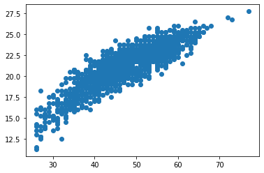
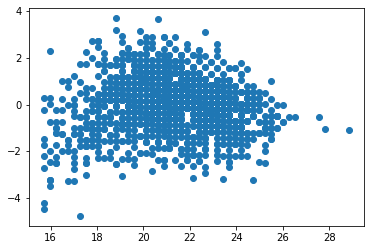
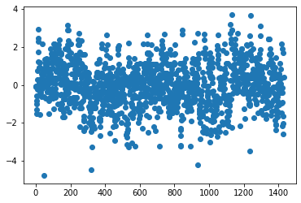
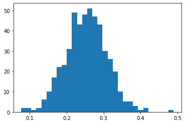
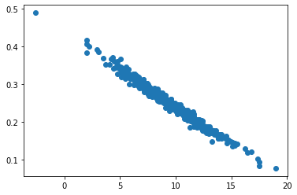
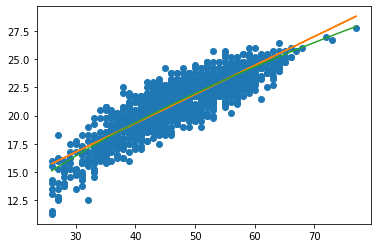

# Python modules
Import modules pandas (as `pd`) numpy (as `np`)
matplotlib.pyplot (as  `plt`) and statsmodels.formula.api (as `smf`)


```{code-cell} python
import pandas as pd
import numpy as np
import matplotlib.pyplot as plt
import statsmodels.formula.api as smf
```

# Simple Regression

### Data Loading
Load eucalyptus data into a pandas DataFrame `eucalypt.txt`
\[`read_csv` of `pandas`\]. On Fun Campus the path is `data/eucalyptus.txt`.

```{code-cell} python
eucalypt = pd.read_csv("data/eucalyptus.txt", header=0, sep=";")
```

### Point Cloud
Plot the point cloud with `circ` as abscissa and `ht` as ordinate


```{code-cell} python
plt.plot(eucalypt['circ'], eucalypt['ht'], "o")
```


    [<matplotlib.lines.Line2D at 0x11d4e72b0>]


    

    


We can see that the points are roughly on a straight line,
so we can propose a linear regression.
For those who think it's too curved to be a straight line,
the "two models" exercise is a simple way of remedying this.

### Simple Regression
Perform a simple linear regression where `circ` is the explanatory variable
and `ht` is the variable to be explained. Store the result
in the `reg` object and 
1. summarize this modeling;
2. display the attribute containing the OLS-estimated parameters of the line;
3. display the attribute containing the estimated standard deviation of the error.


```{code-cell} python
reg = smf.ols('ht~circ', data=eucalypt).fit()
reg.summary()
```


<table class="simpletable">
<caption>OLS Regression Results</caption>
<tr>
  <th>Dep. Variable:</th>           <td>ht</td>        <th>  R-squared:         </th> <td>   0.768</td>
</tr>
<tr>
  <th>Model:</th>                   <td>OLS</td>       <th>  Adj. R-squared:    </th> <td>   0.768</td>
</tr>
<tr>
  <th>Method:</th>             <td>Least Squares</td>  <th>  F-statistic:       </th> <td>   4732.</td>
</tr>
<tr>
  <th>Date:</th>             <td>Thu, 15 Jun 2023</td> <th>  Prob (F-statistic):</th>  <td>  0.00</td> 
</tr>
<tr>
  <th>Time:</th>                 <td>10:45:46</td>     <th>  Log-Likelihood:    </th> <td> -2286.2</td>
</tr>
<tr>
  <th>No. Observations:</th>      <td>  1429</td>      <th>  AIC:               </th> <td>   4576.</td>
</tr>
<tr>
  <th>Df Residuals:</th>          <td>  1427</td>      <th>  BIC:               </th> <td>   4587.</td>
</tr>
<tr>
  <th>Df Model:</th>              <td>     1</td>      <th>                     </th>     <td> </td>   
</tr>
<tr>
  <th>Covariance Type:</th>      <td>nonrobust</td>    <th>                     </th>     <td> </td>   
</tr>
</table>
<table class="simpletable">
<tr>
      <td></td>         <th>coef</th>     <th>std err</th>      <th>t</th>      <th>P>|t|</th>  <th>[0.025</th>    <th>0.975]</th>  
</tr>
<tr>
  <th>Intercept</th> <td>    9.0375</td> <td>    0.180</td> <td>   50.264</td> <td> 0.000</td> <td>    8.685</td> <td>    9.390</td>
</tr>
<tr>
  <th>circ</th>      <td>    0.2571</td> <td>    0.004</td> <td>   68.792</td> <td> 0.000</td> <td>    0.250</td> <td>    0.264</td>
</tr>
</table>
<table class="simpletable">
<tr>
  <th>Omnibus:</th>       <td> 7.943</td> <th>  Durbin-Watson:     </th> <td>   1.067</td>
</tr>
<tr>
  <th>Prob(Omnibus):</th> <td> 0.019</td> <th>  Jarque-Bera (JB):  </th> <td>   8.015</td>
</tr>
<tr>
  <th>Skew:</th>          <td>-0.156</td> <th>  Prob(JB):          </th> <td>  0.0182</td>
</tr>
<tr>
  <th>Kurtosis:</th>      <td> 3.193</td> <th>  Cond. No.          </th> <td>    273.</td>
</tr>
</table><br/><br/>Notes:<br/>[1] Standard Errors assume that the covariance matrix of the errors is correctly specified.


```{code-cell} python
reg.params
```


    Intercept    9.037476
    circ         0.257138
    dtype: float64


```{code-cell} python
reg.scale
```


    1.4380406251002342


### Residuals
Plot the residuals with
1. the `circ` variable on the x-axis and the residuals on the y-axis;
2. on the x-axis, the fit \$\hat y\$$ and on the y-axis, the residuals;
3. on the x-axis, the table line number (index) and on the y-axis, the residuals.


```{code-cell} python
plt.plot(eucalypt['circ'], reg.resid, "o")
```


    [<matplotlib.lines.Line2D at 0x10693a790>]


    

    


The errors according to the model are independent and all have
the same expectation of 0 and the same variance \$\sigma^2\$.
The residuals are a prediction of the errors and should have
the same properties. The variance here is not the same
(the band of points is thinner in places)
and the mean seems to fluctuate. However, these residuals
are quite satisfactory.


```{code-cell} python
plt.plot(reg.predict(), reg.resid, "o")
```


    [<matplotlib.lines.Line2D at 0x11d74f790>]


    

    


Since we're only interpreting the visual form/appearance 
and only the abscissa scale has changed, we obtain the same
the same interpretation as in the previous graph.


```{code-cell} python
plt.plot(np.arange(1,eucalypt.shape[0]+1), reg.resid , "o")
```


    [<matplotlib.lines.Line2D at 0x11d863e80>]


    

    


The fluctuations in the mean of the residuals can be seen again, but this graph is less suitable for the variance in this problem.

# Estimatation variability

### Data Loading
Import eucalytus data into pandas `eucalypt.txt` DataFrame
\[`read_csv` of `pandas`\]. On Fun Campus the path is `data/eucalyptus.txt`.

```{code-cell} python
eucalypt = pd.read_csv("data/eucalyptus.txt", header=0, sep=";")
```

### Estimation on \$n=100\$ data
Create two empty lists `beta1` and `beta2`.
Perform the following steps 500 times
1. Randomly draw 100 rows from the table `eucalypt` without replacement.
2. On this draw perform a simple linear regression
   where `circ` is the explanatory variable and `ht` the variable to be explained. Store estimated parameters in `beta1` and `beta2`.


```{code-cell} python
beta1 = []
beta2 = []
rng = np.random.default_rng(seed=123) # fixe la graine du générateur, les tirages seront les mêmes
for k in range(500):
    lines = rng.choice(eucalypt.shape[0], size=10, replace=False)
    euca100 = eucalypt.iloc[lines]
    reg100 = smf.ols('ht~circ', data=euca100).fit()
    beta1.append(reg100.params[0])
    beta2.append(reg100.params[1])
    
```

### Variability of \$\hat \beta_2\$
Represent the variability of the random variable \$\hat \beta_2\$.


```{code-cell} python
plt.hist(beta2, bins=30)
```


    (array([ 2.,  2.,  1.,  2.,  6., 10., 17., 22., 23., 31., 49., 43., 48.,
            51., 47., 43., 30., 26., 20., 10.,  5.,  5.,  3.,  1.,  2.,  0.,
             0.,  0.,  0.,  1.]),
     array([0.0769774 , 0.09072128, 0.10446515, 0.11820903, 0.1319529 ,
            0.14569678, 0.15944065, 0.17318453, 0.1869284 , 0.20067228,
            0.21441615, 0.22816003, 0.2419039 , 0.25564778, 0.26939166,
            0.28313553, 0.29687941, 0.31062328, 0.32436716, 0.33811103,
            0.35185491, 0.36559878, 0.37934266, 0.39308653, 0.40683041,
            0.42057428, 0.43431816, 0.44806203, 0.46180591, 0.47554978,
            0.48929366]),
     <BarContainer object of 30 artists>)


    

    


This histogram is rather symmetrical, with an outlier around 0.5; apart from this outlier, it resembles the one we'd get with a normal distribution.

### Dependance of \$\hat \beta_1\$ and \$\hat \beta_2\$
Plot the \$\hat \beta_1\$ and \$\hat \beta_2\$ pairs and note the
note the variability of the estimate and the correlation
between the two parameters.


```{code-cell} python
plt.plot(beta1, beta2, "o")
```


    [<matplotlib.lines.Line2D at 0x11dacb370>]


    

    


Here we can see the very strong correlation (the cloud is along a straight line)
negative (the slope is negative). This result illustrates the theoretical
of the negative correlation between the two estimators.
We find our outlier indicating that one sample drawn
sample is different from the others. Among all the trees in the field, some (a significant number) are different, which is expected in this type of test.

# Two models

### Data Loading
Import eucalytus data into pandas `eucalypt` DataFrame
\[`read_csv` of `pandas`\]. On Fun Campus the path is `data/eucalyptus.txt`.

```{code-cell} python
eucalypt = pd.read_csv("data/eucalyptus.txt", header=0, sep=";")
```

### Point Cloud
Plot the point cloud with `circ` as abscissa and `ht` as ordinate
and note that the points are not exactly on a straight line
a straight line, but rather a "square root" curve.


```{code-cell} python
plt.plot(eucalypt['circ'], eucalypt['ht'], "o")
```


    [<matplotlib.lines.Line2D at 0x11dcb9670>]


    

    


### Two simple regressions
1. Perform a simple linear regression where `circ` is the explanatory variable
   the explanatory variable and `ht` the variable to be explained.
   Store the result in the `reg` object.
2. Perform a simple linear regression where the square root of `circ` is the explanatory variable and `ht` is the explanatory variable.
   is the explanatory variable and `ht` is the variable to be explained.
   Store the result in the `regsqrt` object. You can use
   operations and functions in formulas
   (see https://www.statsmodels.org/stable/example_formulas.html)


```{code-cell} python
reg = smf.ols('ht~circ', data=eucalypt).fit()
regsqrt = smf.ols('ht~I(np.sqrt(circ))', data=eucalypt).fit()
```

### Comparison
Add the 2 fits (the straight line and the square root) to the scatterplot
and choose the best model.


```{code-cell} python
sel = eucalypt['circ'].argsort()
plt.plot(eucalypt['circ'], eucalypt['ht'], "o", eucalypt['circ'], reg.predict(), "-", eucalypt.circ.iloc[sel], regsqrt.predict()[sel], "-"  )
```


    [<matplotlib.lines.Line2D at 0x11db77d60>,
     <matplotlib.lines.Line2D at 0x11db77b80>,
     <matplotlib.lines.Line2D at 0x11db77d00>]


    

    


Graphically, the "square root" model seems to fit the points better.
These two models can be compared using R².


```{code-cell} python
reg.rsquared
```


    0.7683202384330652


```{code-cell} python
regsqrt.rsquared
```


    0.7820637720850065


The highest R² selects the best simple regression,
indicating here that the "square root" model is better;
this is a numerical summary of our graphical observation...
